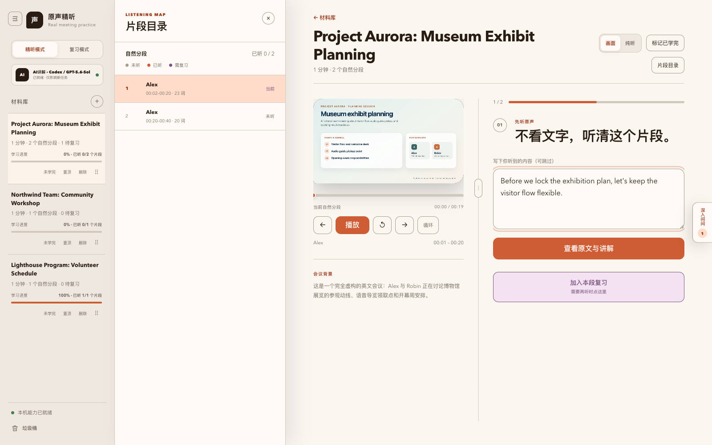
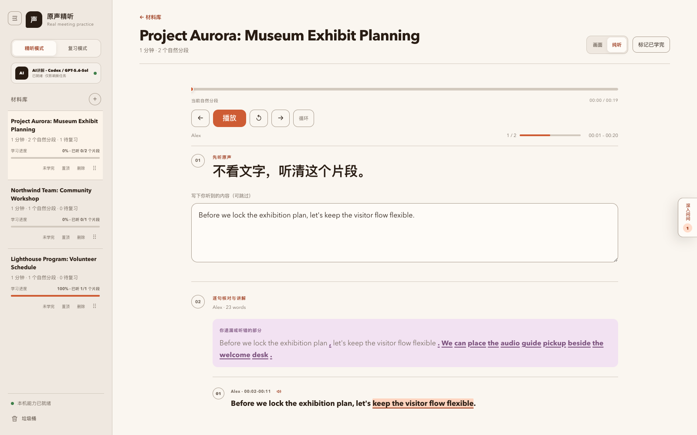
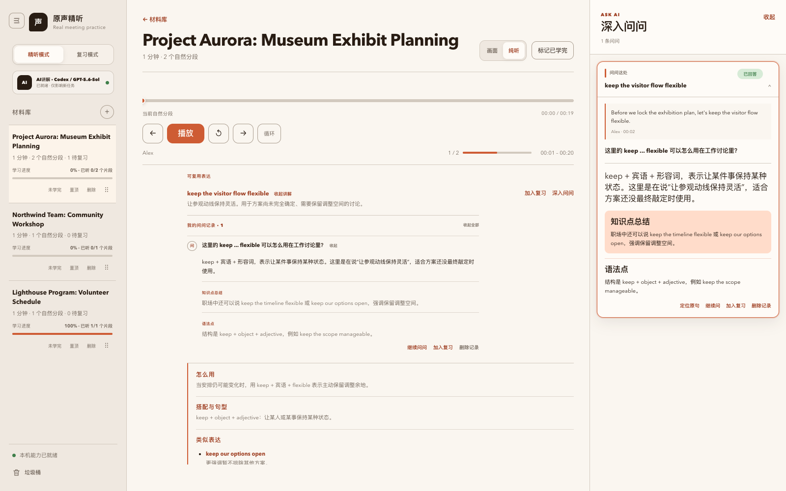

# English Intensive Listening Trainer｜英语精听训练（macOS）

把真实英文会议录音或录屏变成可逐段听写、核对、讲解和复习的本地工具。训练时播放的始终是真实会议原声，不是 AI 配音。

> 这是一个公开提供源代码、在 **macOS 本机自托管** 的英语精听工具。GitHub 仓库只分发代码；它不是 GitHub Pages，也不是云端网站。任何人都可以下载代码并在自己的 Mac 上启动；每位使用者的材料、学习数据和账号彼此隔离。

> 当前版本的 AI 讲解只支持 **Codex** 和 **Cursor**。选择 Codex 时，生成任务会计入当前登录的 Codex/ChatGPT 账号额度；选择 Cursor 时，会计入当前登录的 Cursor 账号额度。项目不提供共享 Token，也不代管任何账号凭据。

> 本项目源码公开，但仅授权用于非商业目的。可以按许可证使用、修改和分发；商业用途需要另行取得权利人的许可。

## 产品一览

> 以下截图来自真实产品界面，但材料标题、说话人、逐字稿和学习记录均为专门制作的虚构演示数据，不包含维护者的真实会议内容。

### 画面精听：原声、听写与逐句讲解



### 纯听模式：音频固定，讲解纵向滚动



### AI 辅助：表达讲解、例句与独立问问卡片



## 最简单：把 GitHub 链接交给 Codex 或 Cursor

仓库已经公开。把 [meeting-listening-lab 仓库链接](https://github.com/sissilolyx/meeting-listening-lab) 发给运行在**你自己 Mac 上**、能够使用本地终端和浏览器的 Codex 或 Cursor。可以只说：

> 请在我的 Mac 上安装或更新这个项目并打开网站：https://github.com/sissilolyx/meeting-listening-lab 。先完整阅读 README 的“给安装代理的执行契约”。复用已有安装目录和本机数据；你是 Codex 就默认使用 Codex，你是 Cursor 就默认使用 Cursor。读取我账号当前可用的模型后在这个对话里让我选，或者打开网页让我选。不要删除、清理或上传 `.data/`、`.models/`，不要替我运行会消耗额度的连接测试。

代理完成后会打开同一个本地网站。不是两套应用，也不需要“从 Codex 打开一个版本、从 Cursor 打开另一个版本”：Codex/Cursor 只是这个网站所调用的 AI 讲解服务。

> 云端 Agent 不能替你保存或打开 Mac 上的本地材料；这条安装方式要求代理能够操作你当前这台电脑。系统依赖安装、约 466 MB 的 Whisper 模型下载以及官方账号登录，仍可能需要你本人确认。

### 给安装代理的执行契约

如果你是接手上述链接的 Codex 或 Cursor，请严格遵守：

1. **先找旧安装，再决定是否 clone。** 查找 remote 指向本仓库的现有目录；找到后必须在原目录更新，不要另建一份 clone，否则新目录会显示空材料库。已有 `update.command` 时直接运行 `./update.command`。很老的版本没有这个文件时，先只获取远端并从远端版本取出安全更新器，再让它检查和更新当前目录：

   ```bash
   git fetch --prune
   git show "@{upstream}:scripts/safe-update.mjs" > /private/tmp/meeting-listening-safe-update.mjs
   node /private/tmp/meeting-listening-safe-update.mjs "$PWD"
   ```

   这条兼容路径也会在合并前检查远端完整目录。确实没有旧安装时才 `git clone`。
2. **不得“清理后重装”。** 禁止 `git reset --hard`、`git clean -fd`、`git clean -fdx`、删除旧目录、自动 stash 或用新 clone 覆盖旧目录。遇到公开代码的本地改动时停止并请用户决定。
3. **本机数据不可读、不可传、不可改。** `.data/` 包含材料、逐字稿、学习进度、复习、问问、学习偏好以及 AI provider/model 设置；`.models/` 包含 Whisper 模型。安装或更新不需要读取其中内容。
4. **依赖安装要先说明。** 先运行 `./setup.command`。执行 Homebrew 安装、`npm run setup:model`、Cursor 的远程安装脚本或任何账号登录前，先说明将发生什么并获得用户确认；绝不索取、复制或写入 Token。
5. **当前版本只支持 Codex 和 Cursor；当前代理决定 provider，用户决定模型。** 首次设置为空时，Codex 会话只建议 `codex`，Cursor 会话只建议 `cursor`；不得静默换用另一个服务。读取该账号的动态模型目录，让用户在当前对话明确选择模型；用户也可以选择在首次打开的网页中设置。
6. **对话内选择不消耗模型额度。** 启动后可从实际本地地址 `GET /api/ai-settings` 读取状态和模型；用户选定后，以 `PATCH /api/ai-settings` 仅保存 `{provider, model}`，再 GET 校验。已有设置时不得覆盖，除非用户明确要求切换。不要调用 `POST /api/ai-settings/test`，也不要为了验收触发讲解或“问问”。
7. **打开实际地址。** 使用 `./start.command`，等待服务可访问后打开脚本实际打印的 `http://127.0.0.1:<端口>/`；端口不一定是 4173，运行终端需要保持打开。

公开仓库的 clone/pull 不需要受邀权限；GitHub 登录只在提交代码等写操作时需要。Codex 或 Cursor CLI 登录决定使用谁的 AI 额度；Lark 登录只用于可选的妙记导入。这三类账号彼此独立，每位使用者都使用自己的账号。

## 先了解数据边界

- 材料、音视频、逐字稿、学习进度、复习内容和“问问”记录默认保存在当前项目的 `.data/`，只在这台电脑的这个项目副本中使用。
- 不同使用者之间没有账号数据同步，也不会同步你的材料。换电脑、换项目目录或删除 `.data/` 后，原来的学习数据不会自动出现。
- 本地音视频由 `whisper.cpp` 在电脑上转写，不会上传到 GitHub，也不会由本项目上传到自建云存储。
- 这是同一个本地网页，不需要分别安装 Codex 版和 Cursor 版。通过本机代理安装时，代理会建议使用它自身对应的服务，并让你在对话里选择模型；手动安装时可在首次打开的网页中选择。以后会记住上次选择，也可以从左侧全局入口随时切换。
- 讲解和“问问”通过本机登录的 Codex CLI 或 Cursor Agent CLI 生成。项目只把完成当前请求所需的逐字稿片段、问题和语境交给你主动选择的服务；原始音频和视频不交给 AI 服务。请只导入符合你所在组织及所选服务使用规则的内容。若内容完全不能离开电脑，请不要使用讲解或“问问”功能。
- 当前版本只支持 Codex 和 Cursor。每位使用者通过自己的官方 CLI 登录并消耗自己的账号额度或 Token；选择 Codex 不会消耗 Cursor 额度，选择 Cursor 也不会消耗 Codex 额度。本项目不提供共享 Token，不要求把 API Key 写进项目，也不会把 Codex/Cursor 凭据写入仓库、`.data/` 或项目配置；登录凭据由各自的官方 CLI 管理。应用不会在两个服务之间静默回退。
- 飞书/Lark 导入是可选能力。使用者需要在自己的电脑上安装并登录 `lark-cli`；本项目不会共享仓库维护者或其他使用者的 Lark 登录。
- 服务默认只监听 `127.0.0.1`。不要把 `HOST` 改成 `0.0.0.0`，不要做端口转发，也不要把它部署到公网服务器。

### 绝对不要提交的本地内容

提交代码或反馈前先运行 `git status`，确认以下内容没有进入 Git：

- `.data/`：所有材料、逐字稿、进度、复习和问问记录
- `.models/`：本地 Whisper 模型
- `.env`、`.env.*`：可能包含个人路径或本地配置
- `.auth/`、`.credentials/`、`.settings/` 及 `*.local`：本机账号或设置残留（正常使用不需要在项目中创建这些文件）

不要为了“方便测试”移除这些忽略规则，也不要在 Issue、截图或日志中暴露会议内容。

## 5 分钟 Quick Start

以下 5 分钟指依赖已经安装后的首次启动；第一次下载约 466 MB 的 Whisper 模型可能需要更久。

如果已经把链接交给 Codex/Cursor，可由代理按上一节完成这些步骤；下面是手动安装方式。

1. 从公开 GitHub 仓库克隆代码：

   ```bash
   git clone https://github.com/sissilolyx/meeting-listening-lab.git
   cd meeting-listening-lab
   ```

2. 双击 `setup.command`，或在终端运行：

   ```bash
   ./setup.command
   ```

   它只检查本机环境并给出修复提示，不会替你修改系统或自动安装软件。

3. 下载本地英文 Whisper 模型；AI 讲解服务可以先准备 Codex、Cursor Agent，或两者都准备：

   ```bash
   npm run setup:model
   ```

   `setup.command` 只检测，不会自动安装或登录任何 AI 服务。账号准备命令见下方“AI 讲解服务”。即使暂时没有可用的 AI 登录，本地网页和听音能力仍可启动；讲解和“问问”会等到你完成选择与登录后再使用。

4. 双击 `start.command`。它会选择本机可用端口、启动服务并打开正确的本地页面。也可以在终端运行：

   ```bash
   ./start.command
   ```

5. 在“本地文件”中选择、拖入或按 `⌘V` 粘贴 MP3、M4A、WAV、MP4、MOV；需要导入飞书妙记时，再完成可选的 Lark 设置。

关闭运行 `start.command` 的终端窗口，或在该终端按 `Control-C`，即可停止服务。

## 系统要求

第一版仅验证 macOS，不保证 Windows 或 Linux 可用。

必需：

- Git
- Node.js 22 或更高版本
- FFmpeg（同时需要 `ffmpeg` 和 `ffprobe`）
- `whisper-cli`（whisper.cpp）
- 本地 Whisper 英文模型 `.models/ggml-small.en.bin`

可选：

- Codex CLI 或 Cursor Agent CLI；当前版本的讲解和“问问”只支持这两种服务，至少需要其中一个已使用当前使用者自己的账号登录
- `lark-cli`，仅在粘贴飞书/Lark 妙记链接时需要

使用 Homebrew 的 Mac 可以先安装常见依赖：

```bash
brew install node@22 ffmpeg whisper-cpp
```

## AI 讲解服务

网页始终通过同一个 `start.command` 启动。当前版本只支持 Codex 和 Cursor。安装代理可以把自身对应的服务作为建议，并在原对话中让你选择模型；也可以不预设，直接由你在第一次打开网页时选择。以后会记住上次选择，并可从左侧全局入口切换。切换服务只影响之后新生成的内容，不会把已有讲解自动重新生成；新任务会计入所选服务当前登录账号的额度或 Token。

### Codex

按照 [Codex CLI 官方说明](https://developers.openai.com/codex/cli) 安装后，由当前使用者本人登录。登录方式和凭据保存规则见 [Codex 认证说明](https://developers.openai.com/codex/auth)：

```bash
npm install -g @openai/codex
codex login
codex login status
```

### Cursor

Cursor 桌面应用和供本项目后台调用的 Cursor Agent CLI 不是同一个命令。按照 [Cursor Agent CLI 官方安装说明](https://cursor.com/docs/cli/installation) 安装后，由当前使用者本人登录；认证说明见 [Cursor CLI Authentication](https://cursor.com/docs/cli/reference/authentication)：

```bash
curl https://cursor.com/install -fsS | bash
cursor-agent login
cursor-agent status
```

安装脚本和登录都会由使用者本人在终端执行；本项目的 `setup.command` 只检测状态，不会代替使用者安装、登录或选择账号。

需要飞书妙记导入时，再安装并登录可选的 Lark CLI：

```bash
npm install -g @larksuite/cli
lark-cli auth login
```

安装后以 `npm run doctor` 的实际检查结果为准。Lark 缺失或未登录不应影响本地文件导入。

## 环境检查

随时运行：

```bash
npm run doctor
```

它会先检查启动和本地听音所必需的 Node.js、FFmpeg、`whisper-cli` 与 Whisper 模型，再分别报告可选的 Codex、Cursor Agent 和 Lark 状态。Codex/Cursor 均未安装或未登录时，环境检查仍可通过并启动网站，只是 AI 讲解尚不可用。

也可以单独确认账号状态：

```bash
codex login status
cursor-agent status
lark-cli auth status --json
```

## 日常启动

推荐双击 `start.command`，它会自动选择空闲端口并打开浏览器。

也可以运行：

```bash
npm start
```

手动启动默认地址为 [http://127.0.0.1:4173](http://127.0.0.1:4173)。如端口被占用，可以改用另一个仅限本机的端口：

```bash
PORT=4174 npm start
```

可选环境变量：

- `PORT`：本地端口，默认 `4173`
- `LISTENING_DATA_DIR`：材料和学习数据目录，默认是项目内的 `.data/`
- `WHISPER_MODEL_PATH`：自定义 Whisper 模型文件路径
- `CODEX_ANALYSIS_BATCH_SIZE`：兼容旧版的讲解批大小设置，默认 `60`
- `SKIP_CODEX_ANALYSIS=1`：只做本地转写，不生成 AI 讲解

请保留默认主机 `127.0.0.1`，不要设置 `HOST=0.0.0.0`。

## 主要能力

- 导入本地 MP3、M4A、WAV、MP4、MOV，或从 macOS「语音备忘录」复制后在页面中按 `⌘V` 粘贴
- 可选导入飞书/Lark 妙记链接，保留官方逐字稿和说话人时间戳
- 本地 Whisper 转写和时间校准；训练时播放真实原声
- 按自然分段听写、拖动进度、1× 原速播放、手动循环、续听和独立滚动
- 核对听写差异，并按自然句展示中文意思、表达与语法
- 对选中表达继续问所选 AI 服务，将生成的知识点加入精确原句复习
- 本地记录已听覆盖度、需复习内容、材料排序、问问历史和最近位置
- 材料删除后进入本地垃圾桶，30 天内可以恢复

## 更新代码而不丢学习数据

更新必须在原来的项目目录中进行。`.data/` 和 `.models/` 已被 Git 忽略，其中的材料、逐字稿、学习进度、问问、复习、AI provider/model 设置和 Whisper 模型都会继续使用。

推荐双击 `update.command`，或在原项目目录运行：

```bash
./update.command
```

它会先获取远端版本，但在改动本地代码前执行失败即停止的安全检查：

- 公开代码有本地改动时停止，不 reset、clean、stash 或覆盖；
- 远端版本误带 `.data/`、`.models/`、凭据路径或媒体文件时拒绝更新；
- 只接受 fast-forward 更新；
- 更新后运行本机环境检查，并提示重新启动。

安全更新本身不会读取或复制材料内容。更新前仍建议做一次额外备份，尤其是保存了不可重新获取的会议材料时。

1. 停止本地服务。
2. 在 Finder 中复制一份 `.data/` 到项目目录之外，或在项目目录运行下面的时间戳备份命令：

   ```bash
   backup_dir="../meeting-listening-lab-data-backup-$(date +%Y%m%d-%H%M%S)"
   cp -R .data "$backup_dir"
   ```

3. 运行安全更新：

   ```bash
   ./update.command
   ```

4. 再次双击 `start.command`。

不要用 `git reset --hard`、`git clean -fd`、`git clean -fdx` 或直接删除整个旧目录来“更新”。不要为了更新而另建 clone；它不会自动知道旧目录中的材料。如果必须迁移目录，请先停止服务并完整复制旧目录中的 `.data/`；`.models/` 可以复制，也可以重新运行 `npm run setup:model` 下载。

## 故障排查

### 页面显示“无法访问此网站”或 `ERR_CONNECTION_REFUSED`

- 确认运行 `start.command` 的终端仍然打开且没有报错。
- 重新双击 `start.command`，使用它实际打开或打印的地址；端口不一定总是 `4173`。
- 运行 `npm run doctor`，先修复标为缺失的必需项。

### macOS 不允许打开 `.command` 文件

第一次可在 Finder 中右键文件并选择“打开”。若文件没有执行权限，在项目目录运行：

```bash
chmod +x setup.command start.command update.command
```

### 提示缺少模型

```bash
npm run setup:model
```

网络中断后可以重新运行；模型保存在 `.models/`，不会进入 Git。

### AI 服务未登录或讲解一直失败

先在网页左侧全局入口确认当前选择的是 Codex 还是 Cursor，并只检查对应服务。应用不会在失败时偷偷改用另一账号。

Codex：

```bash
codex login
codex login status
npm run doctor
```

Cursor：

```bash
cursor-agent login
cursor-agent status
npm run doctor
```

确认显示的是你自己的账号。不要在项目内创建或粘贴 API Key、访问 token 或 Cursor/Codex 登录文件。

### 本地文件可用，但飞书链接不可用

这是可选的 Lark 环境未准备好。安装 `lark-cli` 后，使用自己的 Lark 账号登录，再用 `lark-cli auth status --json` 和 `npm run doctor` 检查。没有 Lark CLI 时仍可继续使用本地音视频。

### `ffmpeg`、`ffprobe` 或 `whisper-cli` 找不到

```bash
brew install ffmpeg whisper-cpp
npm run doctor
```

如果终端能找到命令但双击启动仍找不到，关闭并重新打开 Terminal 后再试。

### 手动 `npm start` 提示端口被占用

优先改用 `start.command` 自动选择空闲端口，或手动指定其他端口：

```bash
PORT=4174 npm start
```

## 删除材料与卸载

- 删除单份材料：在左侧材料库使用“删除”，材料会先进入本机垃圾桶，可在 30 天内恢复。
- 停止工具：关闭启动终端，或按 `Control-C`。本项目不会安装常驻云服务。
- 卸载但保留数据：先把 `.data/` 复制到项目目录之外，再把 `meeting-listening-lab` 文件夹移到 macOS 废纸篓。
- 永久删除全部本地材料：停止服务后，在 Finder 中显示隐藏文件并删除项目内的 `.data/`；模型位于 `.models/`，可以单独删除。

卸载项目不会自动卸载 Node.js、FFmpeg、whisper.cpp、Codex CLI、Cursor Agent CLI 或 Lark CLI，因为其他本地工具也可能在使用它们。

## 开发者检查

```bash
npm run check
npm test
```

提交前再次确认：

```bash
git status
```

仓库中只能出现代码和公开文档，不能出现任何使用者的 `.data/`、`.models/`、`.env`、会议音视频、逐字稿或学习记录。

## 许可证

本项目采用 [PolyForm Noncommercial License 1.0.0](LICENSE)（SPDX：`PolyForm-Noncommercial-1.0.0`）。

任何个人或实体均可在非商业目的下使用、修改和分发本软件及其修改版本，但须遵守许可证条款，并在分发时保留许可证文本或其官方链接，以及所有 `Required Notice:` 声明。

本许可证不授予商业用途权利。如需将本软件用于商业目的，请另行联系仓库所有者取得许可。由于限制商业使用，本项目属于源码公开、源代码可用（source-available）的软件，并非 OSI 定义下的开源软件。
